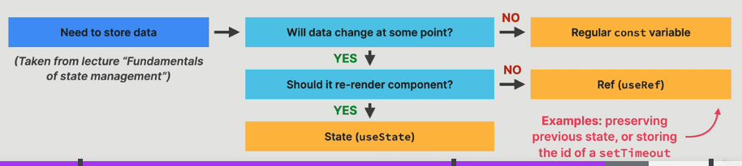
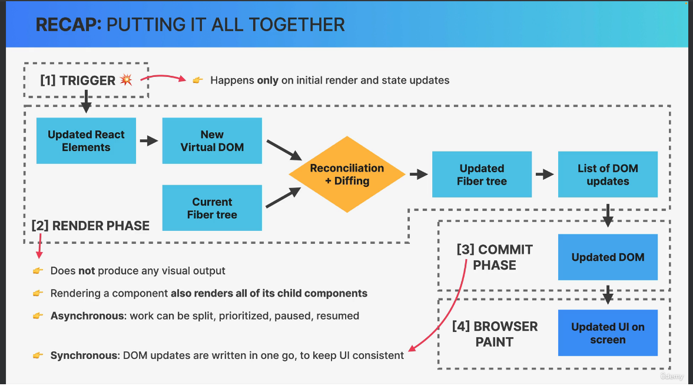
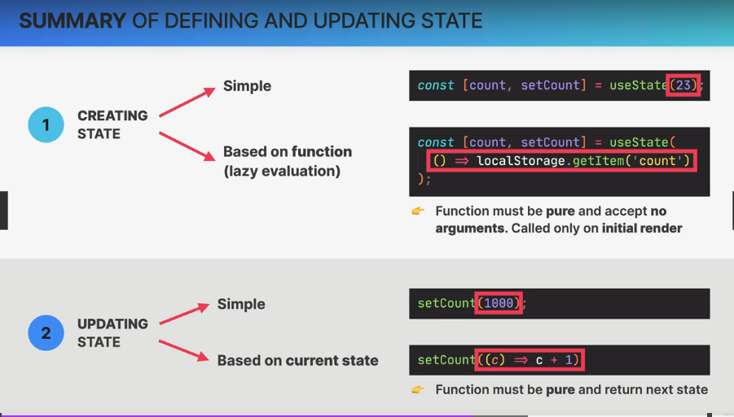
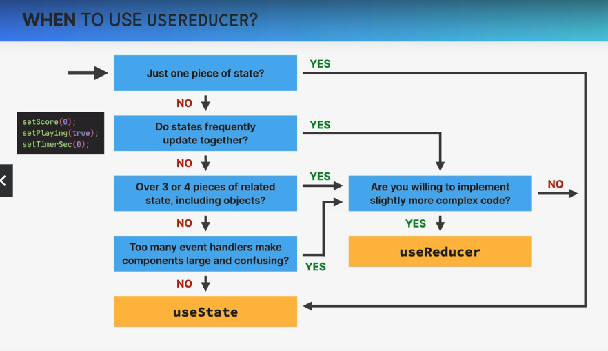
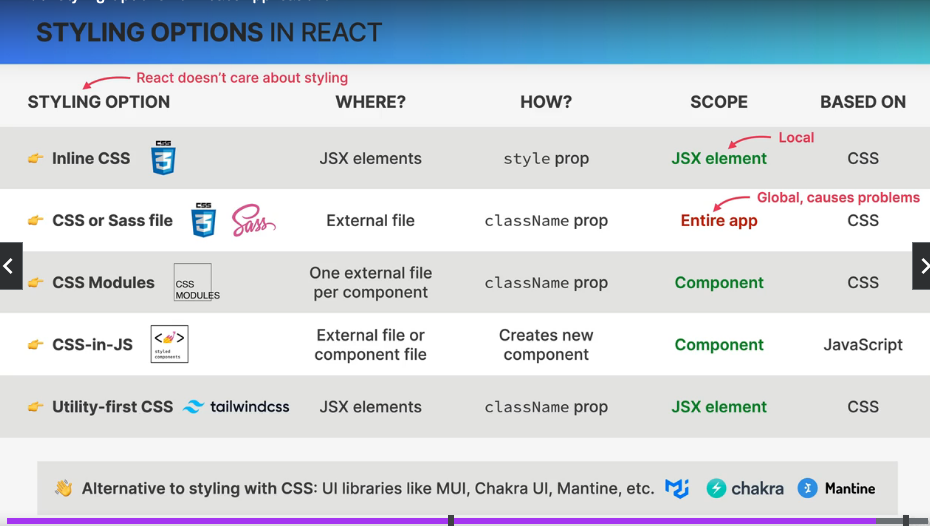
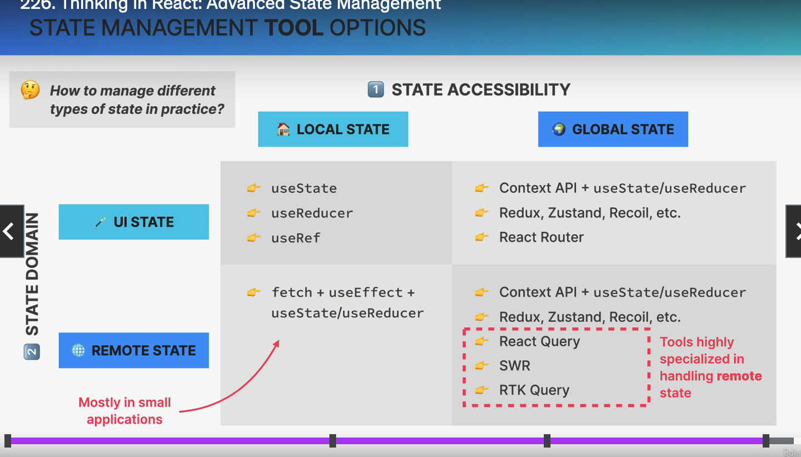
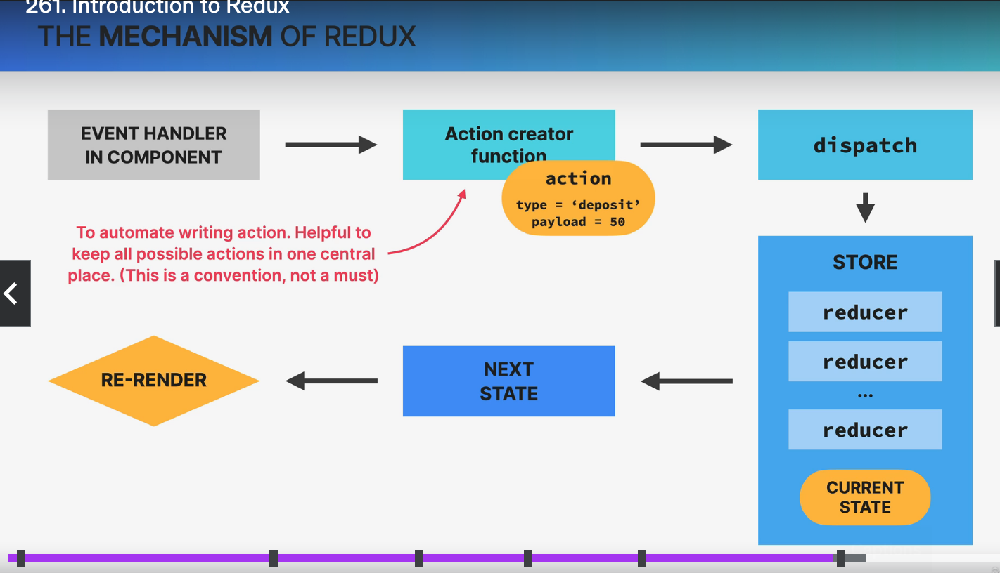

# Part 1

## VSCode setup

Plugin list:

- ESLint
- Prettier - Code formatter
- One Monokai (colour scheme)
- Material Icon Theme
- Auto Rename Tag
- tailwindcss
- vscode-styled-components -> to use `styled-components`

Settings:

- auto save
- default formatter -> prettier
- eslint run -> on save

### VS Code Snippets

Some interesting ones in the [file](./00-setup/snippets.json)
Most inetersting one is the `rfc` one creating the default component function using the file name.

## Webbrowser setup

React Developer Tools

Redux dev tools plugin

## Links

Here are some resources that you might find helpful while studying this Part 1.

- [React](https://react.dev/?ref=jonas.io) (Documentation that you should keep open at all times)
- [Create React App](https://create-react-app.dev/?ref=jonas.io) (This is how we'll setup our first app)
- [Vite](https://vitejs.dev/guide/?ref=jonas.io): Getting Started (For real-world React apps)
- [Adding React URL to an HTML Document](https://gist.githubusercontent.com/gaearon/0275b1e1518599bbeafcde4722e79ed1/raw/db72dcbf3384ee1708c4a07d3be79860db04bff0/example.html) (For the "Pure React" lecture)

## Practical guidelines

- use state vars for any data that the component should keep track of ("remember") over time. This is the data that will change at some point.
- whener you want something in the component to be dynamic, create a piece of state related to that thing. Update the state when the thing should change
- if you want to change the way a component looks, or the data it displays, update its state. This usually happens in an event handller function.
- when building a component, imagine its view as a reflection of state changing over time
- for data that should not trigger component re-renders, don't use states. Use a regular variable instead or use refs. This is a common beginner mistake.



# Part 2

## Links

- [Writing Resilient Components](https://overreacted.io/writing-resilient-components/?ref=jonas.io) (By Dan Abramov from the React team)
- [Things I think about when I write React code](https://github.com/mithi/react-philosophies?ref=jonas.io) (GitHub repository)
- [A (Mostly) Complete Guide to React Rendering Behavior](https://blog.isquaredsoftware.com/2020/05/blogged-answers-a-mostly-complete-guide-to-react-rendering-behavior/?ref=jonas.io) (By Mark Erikson from the redux team)
- [A Visual Guide to React Rendering](https://alexsidorenko.com/blog/react-render-always-rerenders/?ref=jonas.io) (A multi-part series, check out the other ones)
- [Inside Fiber: in-depth overview of the new reconciliation algorithm in React](https://indepth.dev/posts/1008/inside-fiber-in-depth-overview-of-the-new-reconciliation-algorithm-in-react?ref=jonas.io)
- [A Cartoon Intro to Fiber](https://www.youtube.com/watch?v=ZCuYPiUIONs?ref=jonas.io) (YouTube video)
- [What Is React Fiber? React.js Deep Dive](https://www.youtube.com/watch?v=0ympFIwQFJw?ref=jonas.io) (YouTube video)
- [The React and React Native Event System Explained](https://levelup.gitconnected.com/how-exactly-does-react-handles-events-71e8b5e359f2?ref=jonas.io)
- [Under the hood of event listeners in React](https://gist.github.com/romain-trotard/76313af8170809970daa7ff9d87b0dd5?ref=jonas.io)
- [A DIY guide to build your own React](https://github.com/pomber/didact?ref=jonas.io)
- [useSyncExternalStore First Look](https://julesblom.com/writing/usesyncexternalstore?ref=jonas.io)
- [Under the hood of React's hooks system](https://the-guild.dev/blog/react-hooks-system?ref=jonas.io)
- [Why Do React Hooks Rely on Call Order?](https://overreacted.io/why-do-hooks-rely-on-call-order/?ref=jonas.io) (By Dan Abramov)
- [So you think you know everything about React refs](https://blog.thoughtspile.tech/2021/05/17/everything-about-react-refs/?ref=jonas.io)
- [react-use: Reusable React Hook Library](https://github.com/streamich/react-use?ref=jonas.io) (GitHub repository)
- [react-hookz: React hooks done right](https://github.com/react-hookz/web?ref=jonas.io) (GitHub repository)

## Notes

When in doubt, start with a big component, then split into smaller

1. logical speration of content/layout
2. reusabilty
3. responsibilities/complexity
4. personal coding style

About rendering and commiting:


`useEffect` to handle side effects in the render logic. Important not to foget the dependency array in the method.

side effect e.g:

- data fetching
- setting up subscriptions
- setting up timeers
- manually accessing the DOM

effect can run at different moments. Used to keep a component synchornized with some external system.

List of hooks a bit used:

- useState
- useEffect
- useReducer
- useContext
- useRef
- useCallback
- useMemo
- useTransition
- useDeferredValue

Rules of hooks:

1. only be called at the top level (not in conditionals, loops, nested function, or after an early return, ensure that hooks always called in the same order)
1. only call hooks from React function (only called in function component or in custom hook).

But React ESLint enforces these rules.

useState summary:


# Part 3

## Links

- [Tao of React - Software design, Archjitecture and Best Practices](https://alexkondov.com/tao-of-react/?ref=jonas.io)
- [The new wave of React state management](https://frontendmastery.com/posts/the-new-wave-of-react-state-management/?ref=jonas.io)
- [A Visual Guide to React Rendering - useMemo](https://alexsidorenko.com/blog/react-render-usememo?ref=jonas.io)
- [React as a UI Runtime](https://overreacted.io/react-as-a-ui-runtime/?ref=jonas.io) (By Dan Abramov from the React team)
- [You Might Not Need an Effect](https://react.dev/learn/you-might-not-need-an-effect?ref=jonas.io) (Official React docs)
- [A Complete Guide to useEffect](https://overreacted.io/a-complete-guide-to-useeffect/?ref=jonas.io)
- [useEffect sometimes fires before paint](https://blog.thoughtspile.tech/2021/11/15/unintentional-layout-effect/?ref=jonas.io)
- [Making setInterval Declarative with React Hooks](https://overreacted.io/making-setinterval-declarative-with-react-hooks/?ref=jonas.io)
- [Redux - Not Dead Yet!](https://blog.isquaredsoftware.com/2018/03/redux-not-dead-yet/?ref=jonas.io)
- [Why React Context is Not a "State Management" Tool](https://blog.isquaredsoftware.com/2021/01/context-redux-differences/)

### Library documentation

- [Vite](https://vitejs.dev/guide/why.html)
- [CSS Modules](https://github.com/css-modules/css-modules)
- [React Router](https://reactrouter.com/en/main?ref=jonas.io)
- [React Leaflet: Installation](https://react-leaflet.js.org/docs/start-installation/?ref=jonas.io)
- [Redux: Style Guide](https://redux.js.org/style-guide/?ref=jonas.io) (A must-read for Redux users!)
- [Redux Toolkit](https://redux-toolkit.js.org/tutorials/overview?ref=jonas.io)
- [React Redux](https://react-redux.js.org/api/hooks?ref=jonas.io)

## Why reducer?

1. when components have a lot of state variables
1. when multiple state updates need to happen at the same time
1. when updating one piece of state depends on one or multiple other piece of state

## When to use a reducer



## Routers

Most used third party library: react-router
Single page applicatiob, never a hard reload.

## Styles in React



## State in URLs

Great for UI state instead of useState.

1. Easy way to store state in aglobal place, accessible to all components in the app
1. Good way to "pass" data from one page to another
1. Makes it possible to bookmark and share the page with the exact UI state it had at that time

## Context API

- System to pass data throughout the app without manually assing pros downthe triee
- Allows us to "broadcast" global state to the entire app

1. Provider: gives all child components access to the value
1. value: data that we want to make available (usually state and functions)
1. Consumers: all components that read the provided context `value`

When a value is updated, all consumers are re-rendered.

## Types of state

1. State accessibility (if this component was rendered twice, should a state update in one of them reflect in the other one? No -> local, Yes -> global):
   1. Local: one or few components, maybe in component and child compoenents
   1. Global: needed by many components, accessible to every component of the application
1. State domain
   1. Remote state: data loaded from a remote server, suaully asynchronous, needs re-fecthing + updating
   1. UI state: everything else, theme, list filters, form data, etc. Usually synchronous and stored in the application

| Where to place the state | Tools                                  | When to use?                        |
| ------------------------ | -------------------------------------- | ----------------------------------- |
| Local component          | useState, useReducer or useRef         | local state                         |
| Parent component         | useState, useReducer or useRef         | localifting up state                |
| Context                  | Context API + useState or useReducer   | Global stat (preferably UI state)   |
| 3rd-party library        | redux, React Query, SWR, Zustand, etc. | Global state (remote or UI)         |
| URL                      | React router                           | Global state, passing between pages |
| Browser                  | Local storage, session storage, etc    | Storing data in user's browser      |



## Performance optimization tools

1. Prevent wasted renders
   - memo
   - useMemo
   - useCallback
   - passing elements as children or regular prop
1. Improve app speed/responsiveness
   - useMemo
   - useCallback
   - useTransition
1. reduce bundle size
   - using fewer 3rd-part packages
   - code splitting and lazy loading

### Re-render

A comopnent is re-redered when:

- state changes
- context changes
- parent re-render

When a prop changed, the parent provifding them re-rendered re-rendering the child.

### Wasted render

A render which did not produce any change in the DOM, usually no problem because react is really fast, but problem when happen too frequently, or when component is very slow.

#### React plugin in browser

Go in `profiler`, go in setting, `profiler` section, and enable `Record why each componsent rendered while profiling.`

#### optimisation trick with children props

the children prop is not re-rendered because it is own by the component creating it (adding it as a child), in fact the component creating it creates the children component before passing it down in the props.
Because of that, a context provider does not re-render all children.

### Memoization

Excecute a pure function once, and saves the result in memory.
In React, we can memoize components, objects and functions.

#### memo function

Create a componenent that will not re-render if parent re-renders as long as props stay the same.
By default, no memo.

Memo only useful for heavy component (slow re-rendering), re-render often and does with the same props.

Objects and functions can also be memoized to avoid re-rendering of a component having props:

- `useMemo` to memoize objects
- `useCallback` to memoize functions

A bit like `useEffect`, they have a set of dependencies which invalidates the cache if changed.

3 use cases:

- memoizing props to prevent wasted renders
- memoizeing values to avoid expensive re-calculations on every renders
- memoizing values that are used in dependency array of another hook

DO NOT OVERUSE!!!

Note that the setter function of `useState` is not recreated on re-render, so not needed to add them in `useCallback` neither in dependencies.

### Context re-renders optimisation

Optimise only if (all):

- state iobn context change all the time
- context has many consumers
- app is slow and laggy

#### Children prop

Because the children are provided in props, they are created before the provider is created, so not re-rendered by the context changing.

### Small summary

Do:

- find performance bottlenecks using Profiler and visual inspection (laggy UI)
- fix those real performance issues
- memoize expensive re-renders
- memoize expensive calculations
- optimise context if it has many consumers and chages often
- memoize context value + child components
- implement code splitting + lazy loading for SPA routes

Don't:

- don't optimise premnaturely
- don't optimise anything if there is nothing to optimise
- don't wrap all components in `memo()`
- don't wrap all values in `useMemo()`
- don't wrap all functions in `useCallback()`
- don't optimise context if it is not slow and does not have many consumers

## useEffect extras

Dependency array rules:

- every state variable, prop and context value used inside the effect MUST be included in the dependency array
- all "reactive values" must be inlcuded (functions, or variables that reference any other reactive value)
- dependencies choose themselves: NEVER ignore the `exhaustive-deps` ESLint rule!
- do not use objects or arrays as dependencies (objects are recreated on each render, and React sees new objects as different: `{}!={}`)

Removing unnnecessary dependency:

- move function into the effect
- memoize function out
- move it outside the component
- only include the property of the object you need
- move or memoize
- try using a reducer
- no need to put setState, and dispatch in dependenmcy

When not to use effect. An effect should be a last resort, when no other solution makes sense.

3 cases where effects are overused (avoid these):

- responding to a user event. An event handler function should be used instead.
- fetching data on component mount. This is fine in small apps, but in real-world app, a library like React Query should be used
- synchronuzing state changes with one another (settings state based on another state variable). Try to use derived state and event handlers

## Redux!!!

### What is redux?

- 3rd party library to manage global state
- standalone library, but easay to integrate in react with `react-redux`
- all global state is stored in globally accessble store whic his easy to update using "actions" (like `useReducer`)
- it is conceptually similar to Context API + `useReducer`
- 2 versions of redux: classic redux and modern Redux

Redux is for UI global states, not remote states.

Mechanism of Redux: difference with useReducer: a store, and the store will have multiple reducers, and an action creator (which is optional but common for Redux applications).



### Redux middleware

Cannot do async operations in store and reducers need to be pure functions.
The middleware is in between the dispatch, and before the action reaches the reducer.
Nice for async code, API calls, for side effects

Redux Thunk for API calls is the most used 3rd library.

### Redux Toolkit

It is more modern and preferred way of writing Redux code.
It is an opiniated approach, forcing to use Redux best practices.
100% compatible with "calssic" Redux, allowing to be used together.
Allows is to write a lot less code to achieve the same result (less "boilerplate").

Gives 3 big things (but much more too):

1. we can write code that "mutates" state inside reducers (will be converted to immutable logic behind the scenes by "Immer" library)
1. Action creators are automaticallt created
1. Automatic setup of thunk middleware and DevTools.

### Redux vs context api

| context API + `useReducer`                                                                           | Redux                                                                               |
| ---------------------------------------------------------------------------------------------------- | ----------------------------------------------------------------------------------- |
| 👍 built into react                                                                                  | 👎 requires additional pacakage (large bundle)                                      |
| 👍 easy to setup                                                                                     | 👎 more work to setup initially                                                     |
| 👎 additional state "slice" requires new context **set up from scratch** ("provider hell" in App.js) | 👍 once set up, it's easy to create additional state "slices"                       |
| 👎 no mechanism for async operations (should not be used fort remote states)                         | 👍 supports middleware for async operations (should not be used fort remote states) |
| 👎 performance optimization is a pain                                                                | 👍 performance is optimized out of the box                                          |
| 👎 only react dev tools                                                                              | 👍 excellent dev tools                                                              |

#### When to use context api + useReducer

For "small" applications.
When you just need to share a value that does not change often (e.g. color theme, preferred language, authenticated user, ...)
When you need to solve a simple prop drillling problem.
When you need top manage state in a local sub-tree of the app (e.g. in the compound component pattern)

#### When to use Redux

For "large" applications.
When you have lots of gloabl UI state that needs to be updated frequently (because Redux is optimized for this) [shopping cart, current tabs, complex filters or search...]
When you have complex state with nested objects and arrays (because you can mutate state with redux toolkit)

# Part 4

## Useful resources

Here are some high-quality resources that you might find helpful while studying this Part 4. (The list follows the order of sections in this part)

These resources are 100% optional, but might give you additional insights or provide ever deeper dives into some topics.

- [React Libraries for 2023](https://www.robinwieruch.de/react-libraries/?ref=jonas.io) (Written in 2023, but will be up-to-date for years, as the ecosystem is relatively stable now)
- [Styled-components best practices](https://www.joshwcomeau.com/css/styled-components/?ref=jonas.io) (By the excellent writer and educator Josh W. Comeau)
- [A Thorough Analysis of CSS-in-JS](https://css-tricks.com/a-thorough-analysis-of-css-in-js/?ref=jonas.io)
- [Practical React Query](https://tkdodo.eu/blog/practical-react-query?ref=jonas.io) (A huge series from one of React Query's maintainers. Started in 2020, but is still going, and still very helpful)
- [React Query meets React Router](https://tkdodo.eu/blog/react-query-meets-react-router?ref=jonas.io) (From the same series as above)
- [Picking the right React component pattern](https://www.benmvp.com/blog/picking-right-react-component-pattern/?ref=jonas.io)
- [Bulletproof-react: A simple, scalable, and powerful architecture for building production-ready React applications](https://github.com/alan2207/bulletproof-react?ref=jonas.io) (GitHub repository)

Library documentation:

- [Tailwind CSS: Installation With Vite](https://tailwindcss.com/docs/guides/vite?ref=jonas.io)
- [styled-components](https://styled-components.com/docs?ref=jonas.io)
- [Supabase Javascript Client Library](https://supabase.com/docs/reference/javascript/installing?ref=jonas.io)
- [TanStack (React) Query v4](https://tanstack.com/query/v4/docs/react/overview?ref=jonas.io)
- [Recharts](https://recharts.org/en-US/examples?ref=jonas.io)
- [date-fns](https://date-fns.org/docs/Getting-Started/?ref=jonas.io)

## How to plan and build a large and real world react application

Just a rough overview, in real-world, it is never that linear.

1. Gather application **requirements and features**
1. Divide trhe application into **pages**
   - think about the **overall** and **page-level** UI
   - break the desired UI into **components**
   - design and build a **static** version (no state yet)
1. Divide the application into **feature categories**
   - think about **state management + data flow**
1. Decide on what **libraries** to use (technology decision)

## Tailwindcss

### Good

- Don't have to worry about naming classes
- no jumping between files to write markup and styles
- immediately undesdratdn styling in any project that uses tailwind
- design system: many design decisions have been taken for you, which makes UIs look better and more consistent
- saves a lot of time, e.g. on responsive design
- docs and VS Code integration are great

### Bad

- markup (HTML or JSX) looks very unreadable, with lots of class names (you get used to it)
- you have to learn a lot of class names (but after a day of usage you know the fundamentals)
- you need to install and set up tailwind on each new project (10-15 minutes every time)
- you're giving up on "vanilla CSS"...

### Installation

Go in the tailwindcss website, and check how to install for the framework used.
The base styles are defined in the [preflight](https://tailwindcss.com/docs/preflight) page.

Use also https://github.com/tailwindlabs/prettier-plugin-tailwindcss to re-order the classnames.

### Usage

Using responsive designs with `sm:...`

### Section 25 - biggest project

#### Project

Wild oasis

- small boutique hotel with 8 luxurious wooden cabins
- need custom built application to manage everything about the hotel: bookings, cabins, and guests
- internal application used inside the hotel to check in guests as they arrive
- they have nothing right now, so they also need the API
- later they will probably want a customer facing website as well, where customers will be able to book stays using the same API

#### How to plan a react application

1. Gather application requirements and features
1. Divide the application into pages
1. Divide the application into feature categories
1. Decide iobn what libraries to use (tech stack)

#### Project requirements

- users of the app are hotel employees. Logged in to perform tasks
- new users can only be signed up inside the application (to ensure only hotel employees can get accounts)
- users should be able to upload an avatar, and change name and password
- table to view all cabins, showing a cabin photo, name, capacity, price, and current discount
- users should be able to update or delete a cabin, and to create new cabins (including uploading a photo)
- app needs a table to view all bookings, showing arrival and departure dates, status, and paid amount, as well as cabin and guest data
- the booking status can be "unconfirmed" (booked but not yet checked in), "checking in", or "checked out". The table should be filterable by this important status.
- Other booking data includes: nb guests, nb nights, guest observations, whether they booked breakfast, breakfast price
- users should be able to delete, check in, or check out a booking as guest arrives (no edititing necessary for now)
- bookings may not have been paid yet on guest arrival. Therefore, on check in, users need to accept payment (outside the app) and then confirm that payment has been received (inside the app)
- on check in, the guest should have the ability to add breakfast for the entire stay, of they hadn't already
- guest data should contain: full name, email, national ID, nationality, and a country flag for easy identification
- the initial app screen should be a dashboard, to display important information for the last 7, 30 or 90 days:
  - a list of guests checking in and out on the current day. Users should be able to perform these tasks from here
  - statistics on recent bookings, sales, check ins, and occupancy rate
  - a chart showing all daily hotel sales, showing both "total" sales and "extra" sales (only breakfast at the moment)
  - a chart showing statistcis on stay durations, as this is an important metric for the hotel
- users should be able to define a few application-wide settings: breakfast price, min and max nights/booking, max guests/booking
- app needs a dark mode

#### Features to necessary pages

1. Authentication
   - User sign up -> `/users`
   - login -> `/login`
   - account settings -> `/account`
1. Cabins
   - cabins -> `/cabins`
1. Bookings
   - bookings -> `/bookings`
1. Check in/out
   - Booking check in -> `/checkin/:bookingID`
1. Guests
1. Dashboard
1. Settings
   - app settings -> `/settings`

And a dashboard page (including data from all the other features)-> `/dashboard`

#### Tech

Client side rendering (CSR) or server-side rendering (SSR)?

CSR with plain react:

- used to build sinle page applications (SPAs)
- all html is rendered on the client
- all javascript needs to be downloaded before apps start running: bad for performance
- one perfect use case: apps that are used "internally" as tools inside companies, that are entirely hidden behing a login

SS with framework (e.g. Next.js o Remix):

- used to build multi-page applications (MPAs)
- some html is rendered in the server
- more performant as less JS needs to be downloaded
- the react team is moving more and more in this direction

We will go with CSR as just internal

Tech stack:

- routing -> `react router`
- styling -> `styled components` (very popular of writing component scoped CSS, right inside javascript. A tech worth learning)
- remote state management -> `React query` (the best way of managing remote state, with features like caching, automatic re-fecting, pre-fetching, offline support, etc. Alternatives are SWR and RTK query, but this is the most popular)
- UI state management -> `Context API` (there is almost no UI state needed in this app, so one simple context with useState will be nough. Ne need for redux)
- form management -> `react hook form` (handling bigger forms can be a lot of work, such as manual state creation, and error handling. A library can simplify all this.)
- other tools -> `react icons`, `react hot toast`, `recharts`, `date-fns`, `supabase`

### Section 25 - Supabase

- Service that allows devlopers to easily create a back-end with a Postgres db
- automatically creates a db and API so we can easily request and receive data from the server
- no back-end dev needed
- perfect to get up and running quickly
- not just an API: Supabase also comes with easy-to-use user authentication and file storage

#### Model the application state in tables

State "domains"/"slices" needed (for features on the right):

- bookings -> bookings, dashboard, check in and out
- cabins -> cabings
- guests -> guests
- settings -> app settings
- users -> Authentication

All will be global remote state, stored within Supabase.
There will be one table for each state "slice" in the db

Bookings are about guest renting a cabin
Tables are joined using foreign keys.

## React Query

Powerful library for remote states (favorite of the teacher).

Many cool features:

- data is stored in a cache
- automatic loading and error states
- automatic re-fecting to keep state synched
- pre-fetching (e.g. pagination)
- easy remote state mutation (updating)
- offline support

Needed because remote states is fundamentally different from regular UI states.

## New expert React dev patterns

### Render props pattern

To re-use UI and stateful logic (logic with UI attached to it)
Complete control over what the component renders, by passing in a function that tells the component what to render. Was more common before hooks, but still useful.

In a nusthell, provide a `render` props which is a function returning some jsx, and can be used in the component to select how some piece of the components would be rendered.

### Higher-order components (HOC) pattern

It is useful when we try to add functionalities to a component given to us by otehr libraries.

In a nutshell, you create a function named `with...` which take a component class as input, then this function returns a new component function taking the component class props we try to enrich.

```javascript
export default function withToggles(WrappedComponent) {
  return function List(props) {
    const [isOpen, setIsOpen] = useState(true);
    const [isCollapsed, setIsCollapsed] = useState(false);

    const displayItems = isCollapsed ? props.items.slice(0, 3) : props.items;

    function toggleOpen() {
      setIsOpen((isOpen) => !isOpen);
      setIsCollapsed(false);
    }

    return (
      <div className="list-container">
        <div className="heading">
          <h2>{props.title}</h2>
          <button onClick={toggleOpen}>
            {isOpen ? <span>&or;</span> : <span>&and;</span>}
          </button>
        </div>
        {isOpen && <WrappedComponent {...props} items={displayItems} />}

        <button onClick={() => setIsCollapsed((isCollapsed) => !isCollapsed)}>
          {isCollapsed ? `Show all ${props.items.length}` : "Show less"}
        </button>
      </div>
    );
  };
}
```

It is then called elsewhere:

```javascript
const ProductListWithToggles = withToggles(ProductList);
```

You can finally use this `ProductListWithToggles` component with the usual props of the `ProductList` but it now has the extra functionality.

### Compound component pattern

For very self-contained components that need/want to manage their own state. Compound components are like fancy super-components

# Part 5

## Useful resources

- [28 advanced Next.js features that everyone should know](https://codedrivendevelopment.com/posts/rarely-known-nextjs-features) (A must-read for everyone after finishing the course! ☝️)
- [How React Server Components work](https://www.plasmic.app/blog/how-react-server-components-work) (We cover React Server Components (RSC) in great detail, but here is another look at them, with a few more visualizations. Written before RSC was available anywhere, but still good)
- [RSC DevTools](https://www.alvar.dev/blog/creating-devtools-for-react-server-components) (A nice way of visualizing the RSC payload right in Chrome's DevTools)
- [Next.js Image Component Tutorial](https://www.fullstackfoundations.com/blog/nextjs-image-component-tutorial) (Going even more deep into the <Image /> component than we do in the course)
- [Understanding Next.js cache](https://blog.webdevsimplified.com/2024-01/next-js-app-router-cache/) (We cover caching in detail in the course, but this is another very good article on caching)
- [Static Site Generation (SSG) Next.js documentation page](https://nextjs.org/docs/app/building-your-application/deploying/static-exports)
- [High-quality open-source Next.js app for learning](https://tx.shadcn.com/) (A huge modern Next.js codebase that you can learn a lot from)

Framework/library documentation:

- [Next.js documentation](https://nextjs.org/docs)
- [React Server Components documentation](https://react.dev/reference/rsc/server-components) (check out this whole section on the React docs)
- [Auth.js documentation](https://authjs.dev/getting-started)

## Hydration

Hydration adds back the interactivity and event handlers that were lost when the HTML was server-side rendered.
Watering the "dry" HTML with the "water" of interactivity and event handlers.
React builds the component tree on the client and compares it with the actual SSRd DOM: they must be the same so React can adopt it!

## React server components (RSC)

Full stack architecture for React Apps.

Server as an integral part of the React component trees: _server components_. They are only rendered on the server. No interactivity, no state, no JS. Allow to build back-end with React.

Client components -> regular components (using states)

RSC is NOT actiove by default. It needs to be implemented by a framework (e.g. Next.js with the App router)
